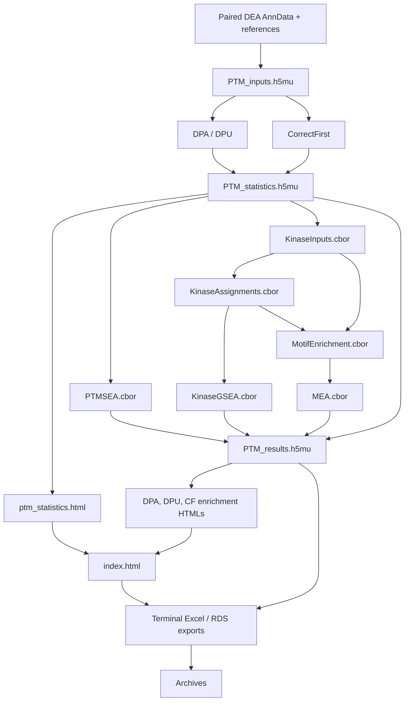

# PTM Pipeline

Deploy and run integrated phosphoproteomics PTM analysis pipelines.
PTM Pipeline scaffolds [Snakemake](https://snakemake.readthedocs.io/)-based workflows
on top of [prolfquapp](https://github.com/prolfqua/prolfquapp) differential expression results.

## Analysis Types

The pipeline implements three complementary statistical approaches for PTM analysis:

| Analysis | Description |
|----------|-------------|
| **DPA** | Differential PTM Abundance -- tests for changes in PTM-site intensity between conditions |
| **DPU** | Differential PTM Usage -- tests whether the PTM-to-protein ratio changes, independent of protein abundance |
| **CorrectFirst** | Applies protein-level correction before testing PTM sites |

Each analysis includes kinase activity inference via [Kinase Library](https://kinase-library.phosphosite.org/) (motif enrichment) and [PTM-SEA](https://doi.org/10.1074/mcp.TIR118.000943) (site-set enrichment).

These analyses are implemented in [**prophosqua**](https://github.com/prolfqua/prophosqua) ([](https://doi.org/10.5281/zenodo.15845272)), described in:

> Wolski W, Dittmann A, Panse C, Kunz L, Grossmann J.
> "Integrated Analysis of Post-Translational Modifications and Total Proteome: Methods for Distinguishing Abundance from Usage Changes."
> *Methods in Molecular Biology*, 2025.

## What the pipeline adds to the DEA results

The two DEA runs happen **before** this pipeline, in prolfquapp: one on the enriched
phospho sample at site level, one on the total proteome at protein level. The pipeline
reads their output and never re-quantifies anything.

So the DPA table is the site-level DEA result -- with its protein-level counterpart
joined alongside, column for column, suffixed `.site` and `.protein`. What the step adds
to a plain DEA result is the pairing and what the pairing makes possible:

- site annotation (`posInProtein`, `modAA`, `SequenceWindow`) joined back onto each row,
- contaminants dropped and UniProt IDs canonicalised so site and protein rows meet,
- untested sites (no FDR) dropped, so DPA and DPU describe the same set of sites,
- the matched/unmatched count per contrast -- a site whose protein was never quantified
  keeps a DPA row with empty `.protein` columns and can carry no DPU value,
- **DPU**, computed from the pair: the effect is the difference of the two log2 fold
  changes, its standard error the root of the summed squares.

`CorrectFirst` starts from the same two DEA runs but goes the other way round: it
corrects site abundances by their protein abundance and *then* fits the model, rather
than comparing two finished models.

## Workflow



Import reads both schema 2.0.0 DEA artifacts and their stored design and contrasts. `PTM_statistics.h5mu` is the shared read-only enrichment input. CBOR files carry each preparation and enrichment result through Snakemake; final assembly writes the nine validated JSON documents into `PTM_results.h5mu`. The statistics QMD reads the statistics H5MU once. The enrichment QMD reads the final H5MU separately for DPA, DPU, and CorrectFirst, producing one HTML per analysis. The index links all four reports; Excel/RDS exports run after them.

`snakemake -j1 data` builds final MuData. `snakemake -j1 reports` renders from it. `snakemake -j1 all` adds terminal delivery exports and archives. R commands run through the installed prophosqua `ptm.sh`; Python kinase calculations use `ptm-kinase-cbor`, installed with ptm-pipeline. Both declare their installed source dependencies.

## Quick Start

```bash
# Install
uv tool install git+https://github.com/wolski/ptm-pipeline

# Initialize and run
cd /path/to/project_with_DEA_results
ptm-pipeline init
make all
```

Or use Docker (no local R/Python setup needed):

```bash
./ptm-pipeline.sh init-default DEA_data/ output/
./ptm-pipeline.sh run output/
```

See the [README](https://github.com/wolski/ptm-pipeline#readme) for full documentation.

## Example Reports

The CI pipeline runs three test datasets on every push to `main`.
The rendered HTML reports are available as downloadable artifacts:

| Dataset | Description |
|---------|-------------|
| PTM_FP_TMT_example | FragPipe TMT quantification |
| PTM_FP_LFQ_example | FragPipe label-free quantification |
| PTM_BGS_Spectronaut_DIA_example | Spectronaut DIA quantification |

**[Download latest test reports](https://github.com/wolski/ptm-pipeline/actions/workflows/ci.yml?query=branch%3Amain+is%3Asuccess)** -- click the latest successful run, then scroll to "Artifacts".

## Methods and References

See [Methods](methods.md) for a full description of the computational workflow, software components, and citation information.

See [R Package Dependencies](packages.md) for how the R packages the pipeline calls depend on each other, and which layer a fix belongs in.

See [Public PTM Datasets](public-datasets.md) for public phosphoproteomics datasets with a factorial design and a matched total proteome, which of them the pipeline can actually consume, and how the search was done.

## Links

- [GitHub Repository](https://github.com/wolski/ptm-pipeline)
- [Docker Image](https://github.com/wolski/ptm-pipeline/pkgs/container/ptm-pipeline-ci)
- [prolfqua](https://github.com/prolfqua/prolfqua) / [prolfquapp](https://github.com/prolfqua/prolfquapp)
- [prophosqua](https://github.com/prolfqua/prophosqua)
