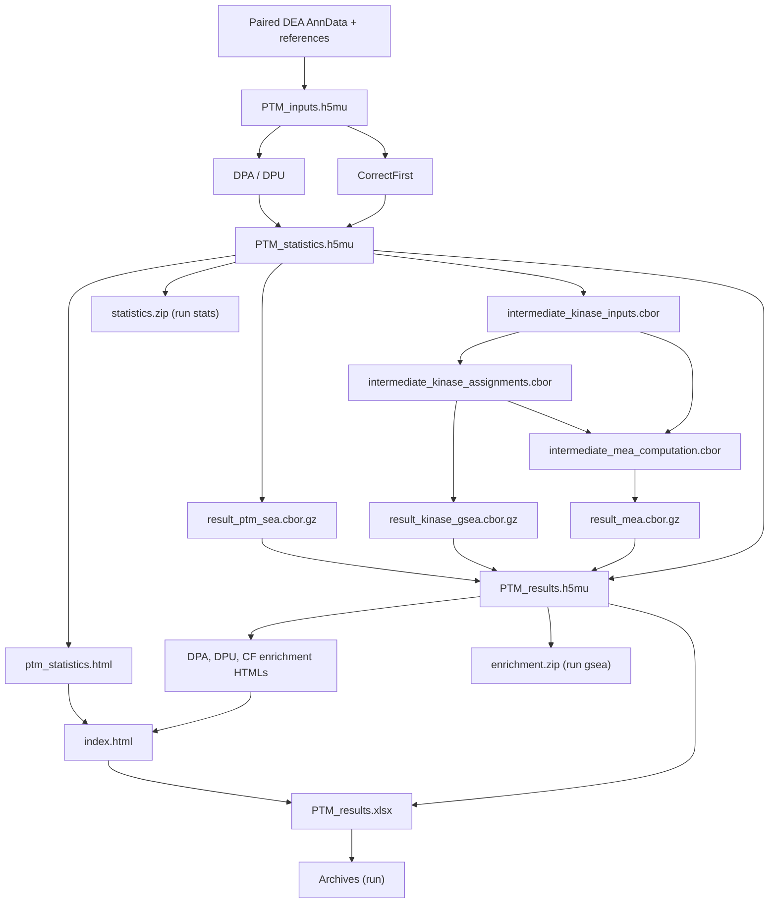

# PTM Pipeline

Deploy and run integrated phosphoproteomics PTM analysis pipelines.
PTM Pipeline scaffolds [Snakemake](https://snakemake.readthedocs.io/)-based workflows
on top of [prolfquapp](https://github.com/prolfqua/prolfquapp) differential expression results.

## Analysis Types

The pipeline implements three complementary statistical approaches for PTM analysis:

| Analysis | Description |
|----------|-------------|
| **DPA** | Differential PTM Abundance -- tests for changes in PTM-site intensity between conditions |
| **DPU** | Differential PTM Usage -- tests whether the PTM-to-protein ratio changes, independent of protein abundance |
| **CorrectFirst** | Applies protein-level correction before testing PTM sites |

Each analysis includes kinase activity inference via [Kinase Library](https://kinase-library.phosphosite.org/) (motif enrichment) and [PTM-SEA](https://doi.org/10.1074/mcp.TIR118.000943) (site-set enrichment).

These analyses are implemented in [**prophosqua**](https://github.com/prolfqua/prophosqua) ([](https://doi.org/10.5281/zenodo.15845272)), described in:

> Wolski W, Dittmann A, Panse C, Kunz L, Grossmann J.
> "Integrated Analysis of Post-Translational Modifications and Total Proteome: Methods for Distinguishing Abundance from Usage Changes."
> *Methods in Molecular Biology*, 2025.

## What the pipeline adds to the DEA results

The two DEA runs happen **before** this pipeline, in prolfquapp: one on the enriched
phospho sample at site level, one on the total proteome at protein level. The pipeline
reads their output and never re-quantifies anything.

So the DPA table is the site-level DEA result -- with its protein-level counterpart
joined alongside, column for column, suffixed `.site` and `.protein`. What the step adds
to a plain DEA result is the pairing and what the pairing makes possible:

- site annotation (`posInProtein`, `modAA`, `SequenceWindow`) joined back onto each row,
- contaminants dropped and UniProt IDs canonicalised so site and protein rows meet,
- untested sites (no FDR) dropped, so DPA and DPU describe the same set of sites,
- the matched/unmatched count per contrast -- a site whose protein was never quantified
  keeps a DPA row with empty `.protein` columns and can carry no DPU value,
- **DPU**, computed from the pair: the effect is the difference of the two log2 fold
  changes, its standard error the root of the summed squares.

`CorrectFirst` starts from the same two DEA runs but goes the other way round: it
corrects site abundances by their protein abundance and *then* fits the model, rather
than comparing two finished models.

## Inside `PTM_statistics.h5mu`

`PTM_statistics.h5mu` is one MuData container with three AnnData modalities under `mod/`. They share the same samples, identified by `obs/Name`; each modality has its own feature axis in `var/` and abundance matrix in `X`.

| AnnData modality | Feature axis | `X` matrix | Differential results stored here |
|---|---|---|---|
| `mod/total` | Proteins (`var/protein_Id`) | Normalized log2 total-protein abundances, samples × proteins | No DPU or CorrectFirst result matrix. |
| `mod/enriched` | Phosphosites (`var/site`, with `var/protein_Id` and `var/fasta.id`) | Normalized log2 site abundances, samples × sites | DPA and DPU results, aligned to these site rows. |
| `mod/cf` | Phosphosites retained for CorrectFirst (`var/site`) | Corrected site abundances, samples × sites | CorrectFirst differential results, aligned to these site rows. |

**DPU is attached to `enriched`; there is no DPU AnnData modality.** For every contrast, `mod/enriched/varm/dpa__<contrast>` and `mod/enriched/varm/dpu__<contrast>` hold numeric result matrices. The DPA effect and FDR columns are `diff.site` and `FDR.site`; the DPU columns are `diff_diff` and `FDR_I`. Unmoderated DPU is also stored as `mod/enriched/varm/dpu_unmoderated__<contrast>`. DPU models the site and protein separately and then compares their effects; its `varm` matrix is aligned to phosphosites, not to the protein rows in `total`.

**CorrectFirst is attached to `cf`.** `mod/cf/X` contains the per-sample, per-site correction `enriched site abundance − matched total-protein abundance` on the log2 scale. The stored values are the unshifted correction; the model adds a constant 20 before fitting, which does not change contrasts. For every contrast, `mod/cf/varm/correct_first__<contrast>` holds the numeric site-level results, with effect `diff.site` and FDR `FDR.site`. A site can be present in `cf/X` without having a CorrectFirst differential result.

Each result matrix has a matching `__present` mask, for example `mod/cf/varm/correct_first__<contrast>__present`. Within the same modality, `uns/prophosqua/result_keys/<method>` lists the matrix keys, `varm_columns/<key>` names their numeric columns, `varm_annotations/<key>` holds aligned nonnumeric result columns, and `varm_order/<key>` records the reconstructed table order. Use the mask to distinguish a missing result row from a present row with a missing numeric estimate; do not interpret every `var` feature as a tested result.

In the HIF2a statistics delivery example, the three `X` shapes are `total` 12 × 7,334, `enriched` 12 × 31,601, and `cf` 12 × 26,201. Its CorrectFirst result mask marks 17,670 site rows as present. These dimensions depend on the analysis. The companion `PTM_inputs.h5mu` in `<dir_out>_statistics.zip` is a separate file, not a fourth modality in `PTM_statistics.h5mu`.

## Workflow



Import reads both schema 2.0.0 DEA artifacts and their stored design and contrasts. `PTM_statistics.h5mu` is the shared read-only enrichment input. Each analysis directory holds three `result_*.cbor` files for PTM-SEA, kinase GSEA, and MEA, plus three `intermediate_*.cbor` handoffs for kinase inputs, kinase assignments, and the Python MEA computation. Final assembly writes the nine validated JSON documents into `PTM_results.h5mu`. The statistics QMD reads the statistics H5MU once. The enrichment QMD reads the final H5MU separately for DPA, DPU, and CorrectFirst, producing one HTML per analysis. The index links all four reports; the single Excel workbook is exported after them.

`ptm-pipeline run` builds the complete workflow, including final MuData, reports, delivery exports, and archives. It can also stop short: `run stats` ends at `PTM_statistics.h5mu` and `run gsea` at the final MuData and its enrichment artifacts, each writing its own archive, and `run dry` previews the jobs of any of the three. See the [CLI reference](cli.md) for every command. R commands run through the installed prophosqua `ptm.sh`; Python kinase calculations use `ptm-kinase-cbor`, installed with ptm-pipeline. Both declare their installed source dependencies.

## Quick Start

```bash
# Install
uv tool install git+https://github.com/wolski/ptm-pipeline

# Initialize and run
cd /path/to/project_with_DEA_results
ptm-pipeline init
ptm-pipeline run
```

Or use Docker (no local R/Python setup needed):

```bash
./ptm-pipeline.sh init default DEA_data/ output/
./ptm-pipeline.sh run output/
```

The [CLI reference](cli.md) lists every command, the depths `run` can stop at, and what each one archives.

## Example Reports

The CI pipeline runs three test datasets on every push to `main`.
The rendered HTML reports are available as downloadable artifacts:

| Dataset | Description |
|---------|-------------|
| PTM_FP_TMT_example | FragPipe TMT quantification |
| PTM_FP_LFQ_example | FragPipe label-free quantification |
| PTM_BGS_Spectronaut_DIA_example | Spectronaut DIA quantification |

**[Download latest test reports](https://github.com/wolski/ptm-pipeline/actions/workflows/ci.yml?query=branch%3Amain+is%3Asuccess)** -- click the latest successful run, then scroll to "Artifacts".

## Methods and References

See [Methods](methods.md) for a full description of the computational workflow, software components, and citation information.

See [R Package Dependencies](packages.md) for how the R packages the pipeline calls depend on each other, and which layer a fix belongs in.

## Links

- [GitHub Repository](https://github.com/wolski/ptm-pipeline)
- [Docker Image](https://github.com/wolski/ptm-pipeline/pkgs/container/ptm-pipeline-ci)
- [prolfqua](https://github.com/prolfqua/prolfqua) / [prolfquapp](https://github.com/prolfqua/prolfquapp)
- [prophosqua](https://github.com/prolfqua/prophosqua)
