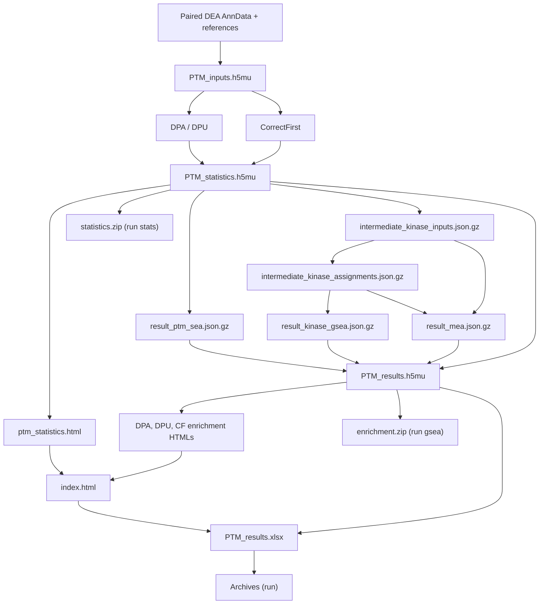

# PTM Pipeline

Deploy and run integrated phosphoproteomics PTM analysis pipelines.
PTM Pipeline scaffolds [Snakemake](https://snakemake.readthedocs.io/)-based workflows
on top of [prolfquapp](https://github.com/prolfqua/prolfquapp) differential expression results.

## Analysis Types

The pipeline implements three complementary statistical approaches for PTM analysis:

| Analysis | Description |
|----------|-------------|
| **DPA** | Differential PTM Abundance -- tests for changes in PTM-site intensity between conditions |
| **DPU** | Differential PTM Usage -- tests whether the PTM-to-protein ratio changes, independent of protein abundance |
| **CorrectFirst** | Applies protein-level correction before testing PTM sites |

Each analysis includes kinase activity inference via [Kinase Library](https://kinase-library.phosphosite.org/) (motif enrichment) and [PTM-SEA](https://doi.org/10.1074/mcp.TIR118.000943) (site-set enrichment).

These analyses are implemented in [**prophosqua**](https://github.com/prolfqua/prophosqua) ([](https://doi.org/10.5281/zenodo.15845272)), described in:

> Wolski W, Dittmann A, Panse C, Kunz L, Grossmann J.
> "Integrated Analysis of Post-Translational Modifications and Total Proteome: Methods for Distinguishing Abundance from Usage Changes."
> *Methods in Molecular Biology*, 2025.

## What the pipeline adds to the DEA results

The two DEA runs happen **before** this pipeline, in prolfquapp: one on the enriched
phospho sample at site level, one on the total proteome at protein level. The pipeline
reads their output and never re-quantifies anything.

So the DPA table is the site-level DEA result -- with its protein-level counterpart
joined alongside, column for column, suffixed `.site` and `.protein`. What the step adds
to a plain DEA result is the pairing and what the pairing makes possible:

- site annotation (`posInProtein`, `modAA`, `SequenceWindow`) joined back onto each row,
- contaminants dropped and UniProt IDs canonicalised so site and protein rows meet,
- untested sites (no FDR) dropped, so DPA and DPU describe the same set of sites,
- the matched/unmatched count per contrast -- a site whose protein was never quantified
  keeps a DPA row with empty `.protein` columns and can carry no DPU value,
- **DPU**, computed from the pair: the effect is the difference of the two log2 fold
  changes, its standard error the root of the summed squares.

`CorrectFirst` starts from the same two DEA runs but goes the other way round: it
corrects site abundances by their protein abundance and *then* fits the model, rather
than comparing two finished models.

## The MuData files

A run writes three MuData files into `<dir_out>`, each a later stage of the one before. All modalities share the samples, identified by `obs/Name`. Every result table is a data frame in `varm`, one per method and contrast.

| File | Stage (`uns/prophosqua/stage`) | Modalities | Adds |
|---|---|---|---|
| `PTM_inputs.h5mu` | `DEA_enriched_total` | `enriched`, `total` | the two DEAs as prolfquapp wrote them, and the run's parameters |
| `PTM_statistics.h5mu` | `PTM_statistics` | `enriched`, `total`, `enriched_CF` | DPA, DPU and CorrectFirst results |
| `PTM_results.h5mu` | `PTM_results` | `enriched`, `total`, `enriched_CF` | the index of the enrichment files beside it |

### Modalities

| Modality | Feature axis (`var`) | `X` | `layers` | Result tables in `varm` |
|---|---|---|---|---|
| `total` | proteins, `var/protein_Id` | normalized log2 protein abundances | the protein DEA's `rawData`, `transformedData`, `imputedData`, `nr_children`, `ibaq` | the protein DEA's own: `constrast_<contrast>`, `imputation`, `stats_normalized_wide`, `stats_raw_wide` |
| `enriched` | phosphosites, `var/site` with `var/protein_Id` | normalized log2 site abundances | the site DEA's `rawData`, `transformedData`, `imputedData`, `nr_children` | the site DEA's own, as in `total`; from `PTM_statistics.h5mu` on also `dpa__<contrast>`, `dpu__<contrast>`, `dpu_unmoderated__<contrast>` |
| `enriched_CF` | the sites of `enriched` whose protein the proteome quantified, in the enriched order | CorrectFirst (CF): site − protein + the sample's median protein abundance, log2; a site CF does not correct is an all-NA column | `correct_first_protein_imputed` (A), `correct_first_site_protein_imputed` (B) | `correct_first__<contrast>` (CF), `correct_first_protein_imputed__<contrast>` (A); B is not fitted |

`constrast_<contrast>` is prolfquapp's spelling of its per-contrast DEA tables. The DEA's `imputation` table holds, per feature, `n_observed`, `n_imputed` and the imputation `route`; see [Imputation, modelling and reporting](imputation.md).

### Result tables

Each result table is a data frame with one row per feature of its modality, in the `var` order, and both numeric and text columns. A feature without a result for that method and contrast has a missing `site`, so the rows with a `site` are the results. `uns/prophosqua/varm_order/<key>` in the same modality records the order of the result table the analysis produced.

| Table | Rows with a result | Effect | FDR | Statistic | Estimate type |
|---|---|---|---|---|---|
| `dpa__<contrast>` | every tested site | `diff.site` | `FDR.site` | `statistic.site` | `estimate_type.site` |
| `dpu__<contrast>`, `dpu_unmoderated__<contrast>` | the sites whose protein has a result (matched) | `diff_diff` | `FDR_I` | `tstatistic_I` | `estimate_type.site` |
| `correct_first__<contrast>` | the sites CF corrects | `diff.site` | `FDR.site` | `statistic.site` | `estimate_type` |
| `correct_first_protein_imputed__<contrast>` | every site of `enriched_CF` | `diff.site` | `FDR.site` | `statistic.site` | `estimate_type` |

DPA and DPU tables also carry the site's and the protein's DEA columns, suffixed `.site` and `.protein`; DPU adds `SE_I`, `df_I` and `pValue_I`. CF and A tables add `n_protein_imputed`, how many of a row's corrected values used an imputed protein. The reports, the workbook and the enrichments show only rows whose site estimate is `observed`, and show A as CorrectFirst.

### Several contrasts

A contrast adds one table per method; nothing else changes shape. With the four contrasts `KO_vs_WT`, `KO_vs_WT_at_Early`, `KO_vs_WT_at_Late` and `KO_vs_WT_at_Uninfect`, `enriched` holds `dpa__KO_vs_WT`, `dpa__KO_vs_WT_at_Early`, … — four tables each for `dpa`, `dpu` and `dpu_unmoderated` — and the DEA's four `constrast_<contrast>` tables; `enriched_CF` holds four `correct_first__` and four `correct_first_protein_imputed__` tables. The contrast definitions are in `enriched_CF/uns/prophosqua/cf/contrasts`.

### `uns`

| Path | Content |
|---|---|
| `uns/prophosqua/stage`, `schema_version` | which of the three files this is, and its layout version |
| `uns/prophosqua/parameters` | the run's settings from `ptm_config.yaml`: `dir_out`, `fdr`, `log2fc`, `run_kinase`, the DEA folders, `analyses`, `contrasts`, and the GSEA and kinase-library settings |
| `uns/prophosqua/provenance` | the paths and md5 sums of the two DEA AnnData files |
| `uns/prophosqua/resources` | the PTMsigDB signature sets and their source |
| `mod/enriched/uns/prophosqua/dpa_dpu` | per contrast, the share of sites matched to a protein; the count of untestable unmoderated DPU pairs |
| `mod/enriched_CF/uns/prophosqua/cf` | the contrasts, the model and measurement counts, and the LFQ configuration of the corrected values |
| `mod/<modality>/uns/prolfquapp` | the DEA's own metadata, in `enriched` and `total` |
| `uns/prophosqua/enrichment_files` | `PTM_results.h5mu` only: the relative path of every enrichment file, keyed `<method>__<analysis>` |
| `uns/prophosqua/enrichment_sha256`, `statistics_sha256` | `PTM_results.h5mu` only: the checksums of those files and of `PTM_statistics.h5mu`; reading refuses a missing or changed file |

### Enrichment files

The enrichment results are not in any MuData file. Each analysis folder holds them beside `PTM_results.h5mu`, which names them in `uns/prophosqua/enrichment_files`:

| Analysis folder | Ranked by | Files |
|---|---|---|
| `PTM_DPA` | `dpa__<contrast>` | `result_ptm_sea.json.gz`, `result_kinase_gsea.json.gz`, `result_mea.json.gz`, `intermediate_kinase_inputs.json.gz`, `intermediate_kinase_assignments.json.gz` |
| `PTM_DPU` | `dpu__<contrast>` | as above |
| `PTM_CF_DPU` | `correct_first_protein_imputed__<contrast>` (A) | as above |

- `result_ptm_sea.json.gz`, `result_kinase_gsea.json.gz`: written by protsea, one gseaResult per contrast
- `result_mea.json.gz`: written by the kinase-library step (`ptm-kinase enrich`), in the same document format
- `intermediate_kinase_inputs.json.gz`: the sequence windows and per-contrast rankings, written by prophosqua for the kinase-library tool
- `intermediate_kinase_assignments.json.gz`: the kinase-library motif scan, written by `ptm-kinase scan` and read by prophosqua's Kinase GSEA and by the MEA

Every file is gzipped JSON. The two intermediates are stage envelopes naming the stage, the analysis and the checksum of the `PTM_statistics.h5mu` they were computed from, so a reader refuses one from another run; their values carry their type and missing mask, and doubles are written with 17 significant digits, exactly.

### Example sizes

The numbers below are those of one example run (o43037, one contrast, 12 samples) and change with every analysis: `total` 12 × 7,334; `enriched` 12 × 31,601, with 31,491 DPA and 26,201 DPU rows with a result; `enriched_CF` 12 × 26,201, with 25,349 CF and 26,201 A rows with a result.

## Workflow


```mermaid
flowchart TB
    DEA["Paired DEA AnnData + references"] --> INPUT["PTM_inputs.h5mu"]
    INPUT --> DPA["DPA / DPU"]
    INPUT --> CF["CorrectFirst"]
    DPA --> STATS["PTM_statistics.h5mu"]
    CF --> STATS
    STATS --> STATS_REPORT["ptm_statistics.html"]
    STATS --> SEA["result_ptm_sea.json.gz"]
    STATS --> PREP["intermediate_kinase_inputs.json.gz"]
    PREP --> ASSIGN["intermediate_kinase_assignments.json.gz"]
    ASSIGN --> GSEA["result_kinase_gsea.json.gz"]
    ASSIGN --> MEA["result_mea.json.gz"]
    PREP --> MEA
    SEA --> FINAL["PTM_results.h5mu"]
    GSEA --> FINAL
    MEA --> FINAL
    STATS --> FINAL
    FINAL --> ENRICH_REPORT["DPA, DPU, CF enrichment HTMLs"]
    STATS_REPORT --> INDEX["index.html"]
    ENRICH_REPORT --> INDEX
    INDEX --> EXPORT["PTM_results.xlsx"]
    FINAL --> EXPORT
    EXPORT --> ZIP["Archives (run)"]
    STATS --> STATS_ZIP["statistics.zip (run stats)"]
    FINAL --> ENRICH_ZIP["enrichment.zip (run gsea)"]
```

Import reads both DEA artifacts, written by prolfquapp 2.10.5 (schema 2.1.0), through prolfquapp's `DEAResultReader`, with their stored design and contrasts. `PTM_statistics.h5mu` is the shared read-only enrichment input. Each analysis directory holds the three `result_*.json.gz` enrichment documents and the two `intermediate_*.json.gz` kinase-library handoffs. Final assembly writes `PTM_results.h5mu`, which records their relative paths and checksums; the documents stay beside it. The statistics QMD reads the statistics H5MU once. The enrichment QMD reads the final H5MU separately for DPA, DPU, and CorrectFirst, producing one HTML per analysis. The landing page, prophosqua's `ptm_index.qmd`, links all four reports; the single Excel workbook is exported after them.

`ptm-pipeline run` builds the complete workflow, including final MuData, reports, delivery exports, and archives. It can also stop short: `run stats` ends at `PTM_statistics.h5mu` and `run gsea` at the final MuData and its enrichment artifacts, each writing its own archive, and `run dry` previews the jobs of any of the three. See the [CLI reference](cli.md) for every command. R commands run through the installed prophosqua `ptm.sh`; Python kinase calculations use `ptm-kinase`, installed with ptm-pipeline. Both declare their installed source dependencies.

## Quick Start

```bash
# Install
uv tool install git+https://github.com/wolski/ptm-pipeline

# Initialize and run
cd /path/to/project_with_DEA_results
ptm-pipeline init
ptm-pipeline run
```

Or use Docker (no local R/Python setup needed):

```bash
./ptm-pipeline.sh init default DEA_data/ output/
./ptm-pipeline.sh run output/
```

The [CLI reference](cli.md) lists every command, the depths `run` can stop at, and what each one archives.

## Example Reports

The CI pipeline runs three test datasets on every push to `main`.
The rendered HTML reports are available as downloadable artifacts:

| Dataset | Description |
|---------|-------------|
| PTM_FP_TMT_example | FragPipe TMT quantification |
| PTM_FP_LFQ_example | FragPipe label-free quantification |
| PTM_BGS_Spectronaut_DIA_example | Spectronaut DIA quantification |

**[Download latest test reports](https://github.com/wolski/ptm-pipeline/actions/workflows/ci.yml?query=branch%3Amain+is%3Asuccess)** -- click the latest successful run, then scroll to "Artifacts".

## Methods and References

See [Methods](methods.md) for a full description of the computational workflow, software components, and citation information.

See [R Package Dependencies](packages.md) for how the R packages the pipeline calls depend on each other, and which layer a fix belongs in.

## Links

- [GitHub Repository](https://github.com/wolski/ptm-pipeline)
- [Docker Image](https://github.com/wolski/ptm-pipeline/pkgs/container/ptm-pipeline-ci)
- [prolfqua](https://github.com/prolfqua/prolfqua) / [prolfquapp](https://github.com/prolfqua/prolfquapp)
- [prophosqua](https://github.com/prolfqua/prophosqua)
